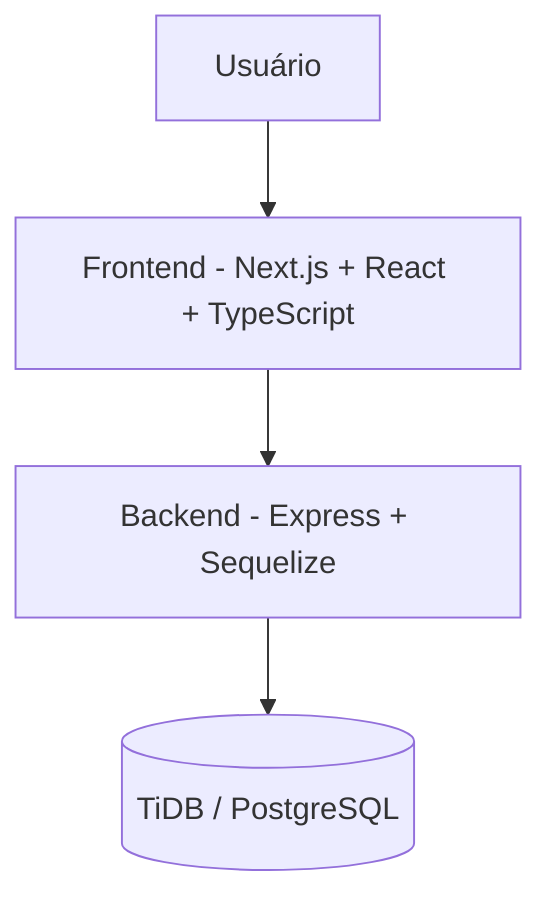

# 📄 Documentação do Projeto – Fluxo de Admissão de Membros

## 🧩 Arquitetura da Solução



---

## 🗃️ Modelo de Dados

| Tabela         | Campos Principais                                                                     | Relacionamentos                      |
| -------------- | ------------------------------------------------------------------------------------- | ------------------------------------ |
| **Candidatos** | id, nome, email, empresa, whyUs, login, senha, aprovacao (analise/aprovado/reprovado) | 1 → 1 com Convites (quando aprovado) |
| **Membros**    | id, nome, email, telefone, cargo, empresa, ativo                                      | N → N com Reuniões e Indicações      |
| **Reunioes**   | id, titulo, datahora, local                                                           | N → N com Membros (presenças)        |
| **Presencas**  | id, membroid, data, presente                                                          | FK para Membros e Reuniões           |
| **Avisos**     | id, titulo, mensagem, autorid                                                         | FK para Membros/Admin                |
| **Indicacoes** | id, membroOrigemId, membroDestinoId, descricao, status (enviada, aceita, fechada)     | FK para Membros                      |

🧠 **Banco escolhido:** TiDB/PostgreSQL (relacional, permite consultas estruturadas e relacionamentos complexos).

---

## 🧱 Estrutura do Frontend (Next.js + React + TypeScript)

```
frontend/
├── pages/
│   ├── index.tsx               # Landing Page / Formulário de Intenção
│   ├── login.tsx               # Login de candidatos/admin
│   ├── aprovados/[id].tsx      # Página de cadastro completo (token)
│   ├── analise.tsx             # Página "em análise"
│   ├── reprovados.tsx          # Página "reprovado"
│   ├── admin/
│   │   └── index.tsx           # Dashboard admin: lista de candidatos
│   └── reunioes/
│       ├── index.tsx           # Listagem de reuniões
│       └── [id]/checkin.tsx    # Página de check-in
│
├── components/
│   ├── FormIntencao.tsx
│   ├── TabelaCandidatos.tsx
│   ├── ModalAprovacao.tsx
│   ├── FormReuniao.tsx
│   └── AvisoCard.tsx
│
├── context/
│   └── AuthContext.tsx         # Estado global de autenticação
│
├── hooks/
│   └── useFetch.ts             # Hook genérico para chamadas API
│
├── services/
│   └── api.ts                  # Axios configurado para backend
│
├── types/
│   ├── Candidato.ts
│   ├── Membro.ts
│   ├── Reuniao.ts
│   ├── Presenca.ts
│   └── Aviso.ts
│
├── public/
│   └── assets/
└── styles/
    └── globals.css
```

🔗 **Comunicação:** Axios → rotas REST do backend
🧩 **Gerenciamento de estado:** Context API + Hooks
🎨 **UI:** Componentes reutilizáveis (tabelas, formulários, modais)

---

## 🌐 Definição da API (Backend – Express + Sequelize)

### 🔹 1. Fluxo de Admissão de Membros

**POST** `/addcandidato`
*Request:*

```json
{
  "nome": "Carlos",
  "email": "carlos@email.com",
  "empresa": "Empresa X",
  "whyUs": "Desejo participar",
  "login": "carlos123",
  "senha": "1234"
}
```

*Response:*

```json
{ "mensagem": "Intenção cadastrada com sucesso", "status": "analise" }
```

**POST** `/login`
*Request:*

```json
{ "email": "carlos@email.com", "senha": "1234" }
```

*Response (candidato aprovado):*

```json
{ "token": "JWT_TOKEN", "aprovacao": "aprovado", "id": 1 }
```

*Response (admin):*

```json
{ "token": "JWT_TOKEN", "admin": true }
```

**POST** `/aprovar/:id`
*Aprova a intenção de um candidato*
**POST** `/reprovar/:id`
*Recusa a intenção de um candidato*

---

### 🔹 2. Gestão de Reuniões

**GET** `/reunioes`
*Listagem de reuniões*

**POST** `/admin/reunioes/nova`
*Cria nova reunião*

**POST** `/reunioes/:id/checkin`
*Registro de presença do membro*

---

### 🔹 3. Avisos

**GET** `/avisos`
*Listagem de avisos*

**POST** `/admin/avisos`
*Cria novo aviso (admin)*

---

## 📊 Relatórios e Dashboards

* **Dashboard Admin:** lista de candidatos e status, botões aprovar/reprovar
* **Dashboard Membro:** lista de reuniões, presença, avisos
* **Filtros:** semanal, mensal e acumulado

---

## ⚙️ Tecnologias Utilizadas

| Camada   | Tecnologias                                    |
| -------- | ---------------------------------------------- |
| Frontend | Next.js, React, TypeScript, Axios, Context API |
| Backend  | Node.js, Express, Sequelize                    |
| Banco    | TiDB / PostgreSQL                              |
| Ambiente | Node 20+, npm, dotenv                          |

---

## 🧾 Checklist da Entrega – Módulo Obrigatório ✅

* [x] Documento de arquitetura e API (Markdown)
* [x] Frontend em Next.js/React com TypeScript
* [x] Backend funcional com Express e Sequelize
* [x] Fluxo completo: envio de intenção → aprovação → cadastro completo
* [x] Dashboard admin com lista de candidatos e ações de aprovação/recusa

---

💡 **Autor:** Carlos Eduardo da Silva (Pood)
🧠 Projeto criado como teste técnico de desenvolvedor full stack
