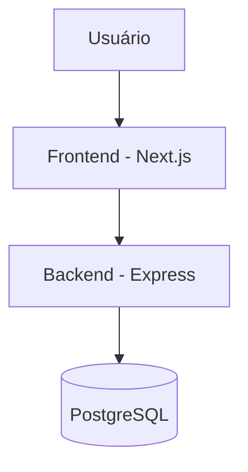

## 🧩 Arquitetura da Solução


---

## 🗃️ Modelo de Dados

| Tabela | Campos Principais | Relacionamentos |
|--------|--------------------|-----------------|
| **Intencoes** | id, nome, email, status (pendente/aprovada/recusada) | 1 → 1 com Membros (quando aprovada) |
| **Membros** | id, nome, email, telefone, cargo, empresa, ativo | N → N com Reuniões / Indicações |
| **Indicacoes** | id, membroOrigemId, membroDestinoId, descricao, status (enviada, aceita, fechada) | FK para Membros |
| **Obrigados** | id, membroId, mensagem, data | FK para Membros |
| **Reunioes** | id, data, tipo (semanal, 1a1), participantes[] | N → N com Membros |
| **Mensalidades** | id, membroId, mes, valor, status (pago/pendente) | FK para Membros |

🧠 **Banco escolhido:** PostgreSQL (SQL relacional, ideal para consultas estruturadas e relacionamentos entre membros, reuniões e indicações).

---

## 🧱 Estrutura do Frontend (Next.js)

```
frontend/
├── pages/
│   ├── index.jsx               # Landing Page / Login
│   ├── membros/                # Gestão de membros
│   ├── reunioes/               # Check-ins e reuniões
│   ├── indicacoes/             # Sistema de indicações
│   └── financeiro/             # Controle de mensalidades
│
├── components/
│   ├── FormIntencao.jsx
│   ├── TabelaMembros.jsx
│   ├── DashboardResumo.jsx
│   └── ModalAprovacao.jsx
│
├── context/
│   └── AuthContext.jsx         # Estado global de autenticação
│
└── services/
    └── api.js                  # Axios configurado para backend
```

🧩 **Gerenciamento de estado:** Context API e Hooks.  
🎨 **UI:** Componentes reutilizáveis (modais, tabelas, formulários).  
🔗 **Comunicação:** Axios → rotas REST do backend.

---

## 🌐 Definição da API (Backend - Express)

### 🔹 1. Intenções de Participação

**POST** `/api/intencoes`  
_Request:_
```json
{ "nome": "Carlos", "email": "carlos@email.com", "telefone": "99999-9999" }
```
_Response:_
```json
{ "id": 1, "status": "pendente" }
```

**PUT** `/api/intencoes/:id/aprovar`  
_Aprova a intenção e cria um membro vinculado._

---

### 🔹 2. Indicações de Negócios

**POST** `/api/indicacoes`  
_Request:_
```json
{ "origemId": 1, "destinoId": 2, "descricao": "Indicação de parceria comercial" }
```
_Response:_
```json
{ "id": 5, "status": "enviada" }
```

**PUT** `/api/indicacoes/:id/status`  
_Atualiza status da indicação (aceita, fechada)._

---

### 🔹 3. Controle de Presença

**POST** `/api/reunioes/checkin`  
_Request:_
```json
{ "membroId": 1, "reuniaoId": 10 }
```
_Response:_
```json
{ "mensagem": "Check-in registrado com sucesso!" }
```

---

## 📊 Relatórios e Dashboards

- **Dashboard do Membro:** total de indicações enviadas, recebidas e negócios fechados.  
- **Dashboard do Grupo:** média de negócios fechados, participação em reuniões e taxa de pagamento.  
- **Filtros:** semanal, mensal e acumulado.

---

## 💰 Módulo Financeiro

- Geração automática de mensalidades.  
- Atualização de status de pagamento (manual ou via integração futura).  
- Relatório de inadimplência por período.

---

## ⚙️ Tecnologias Utilizadas

| Camada | Tecnologias |
|--------|--------------|
| **Frontend** | Next.js, React, Context API, Axios |
| **Backend** | Node.js, Express, Sequelize |
| **Banco** | PostgreSQL |
| **Ambiente** | Node 20+, npm ou yarn, .env com variáveis de conexão |

---

## 🧾 Checklist da Entrega – Tarefa 1 ✅

- [x] Documento de Arquitetura (Markdown no repositório)  
- [x] Diagrama da Arquitetura (Mermaid)  
- [x] Modelo de Dados detalhado  
- [x] Estrutura de Componentes do Frontend  
- [x] Definição da API (3 funcionalidades descritas)  

---

💡 **Autor:** Carlos Eduardo da Silva (Pood)  
🧠 Projeto criado para teste técnico de desenvolvedor full stack.
